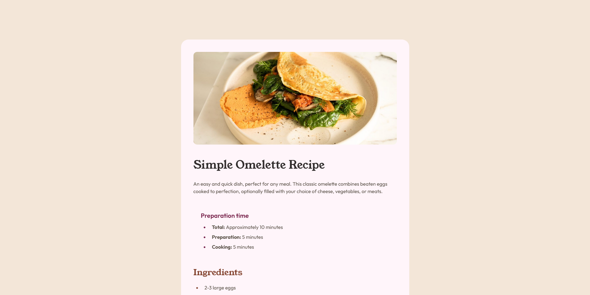

# Frontend Mentor - Recipe page solution

This is a solution to the [Recipe page challenge on Frontend Mentor](https://www.frontendmentor.io/challenges/recipe-page-KiTsR8QQKm). Frontend Mentor challenges help you improve your coding skills by building realistic projects. 

## Table of contents

- [Overview](#overview)
  - [Screenshot](#screenshot)
  - [Links](#links)
- [My process](#my-process)
  - [Built with](#built-with)
  - [What I learned](#what-i-learned)
- [Author](#author)

## Overview

This simple recipe page is built using HTML and CSS. I have used several html elements like lists and table. I also implemented semantic layouting and responsive design.

### Screenshot

### Links

- Solution URL: [Add solution URL here](https://www.frontendmentor.io/solutions/simple-recipe-page-built-with-list-table-and-some-other-elements-ueCy_Kjmpg)
- Live Site URL: [Add live site URL here](https://schindlerdumagat.github.io/recipe-page/)

## My process

In order to follow the mobile first approach, I started building the page in mobile view first and going up to wider screens. Moreover, I started to build each section starting from the top with the image banner to the bottom with the nutrition section.

### Built with

- Semantic HTML5 markup
- HTML List and Table elements
- CSS custom properties
- Flexbox
- Mobile-first workflow

### What I learned

By building this project taught me a lot things. I learned how to use html list and table elements. I learned some tricks like putting borders on each row in a table element. I learned how to position list properly. Moreover, I was able to practice responsive design, semantic layouting and writing CSS.

## Author

- Website - [Schindler C. Dumagat](https://schindlerdumagat.github.io/webportfolio/)
- Frontend Mentor - [@schindlerdumagat](https://www.frontendmentor.io/profile/schindlerdumagat)
- LinkedIn - [@schindlerdumagat](https://www.linkedin.com/in/schindler-dumagat-015238230/)
